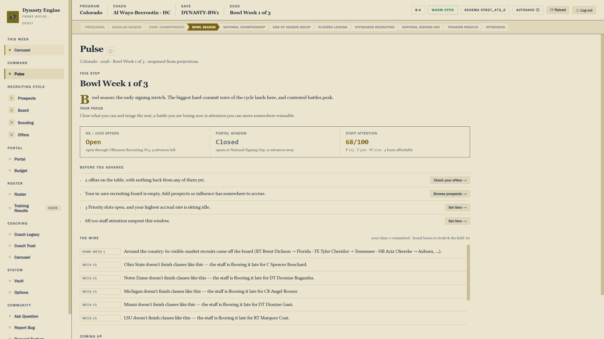
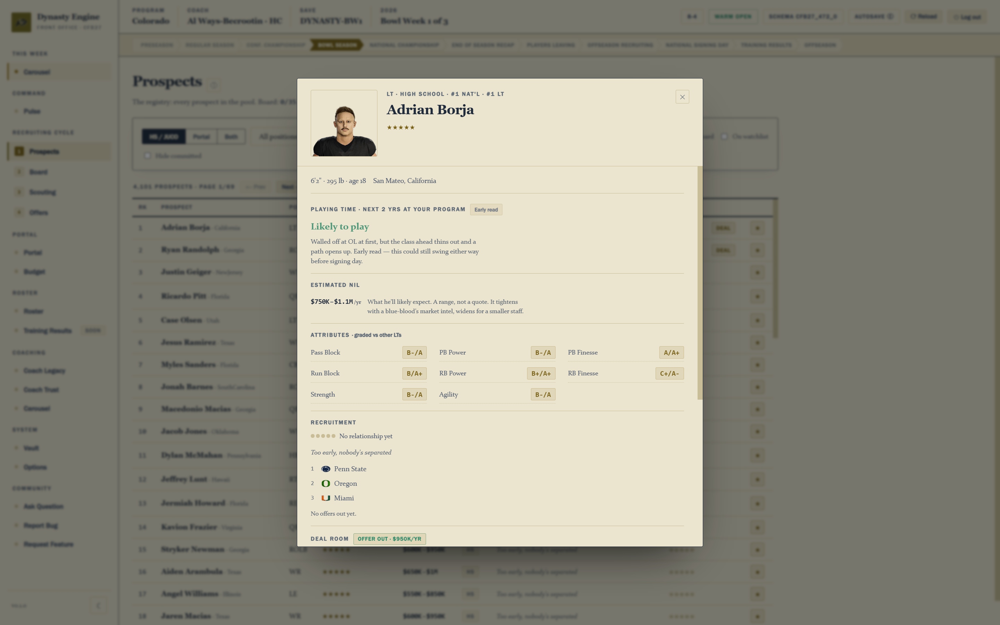
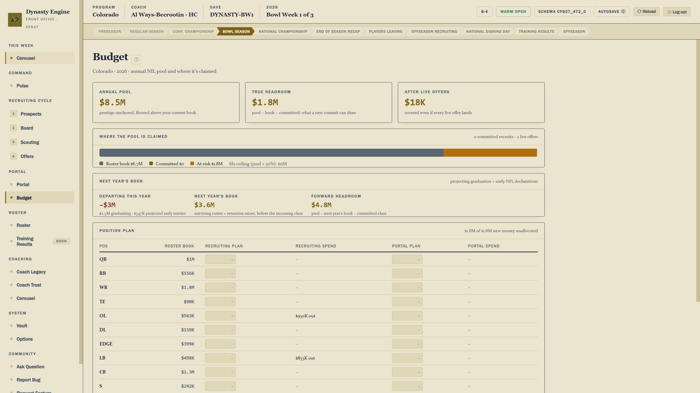

# Dynasty Engine

An external front-office / GM tool for a CFB27 dynasty. It runs alongside the
game as its own app and takes over recruiting, the transfer portal, coaching
moves, and NIL (the front-office side of running a program), while CFB27
itself keeps doing what it does best: playing and simulating games.

The app opens your real dynasty save, reads it directly, and writes decisions
back into it when you commit them. There's no separate universe to keep in
sync, and no re-entering your roster or your class by hand.

**Why it exists:** CFB27's on-field game is deep, but the front-office layer
around it (who you recruit, how the portal shakes out, what NIL actually buys,
how a coaching career plays out over a decade) is thin and mostly invisible.
There's no real memory across seasons: where did this player actually come
from, what has this coach actually built? And the recruiting and portal
systems the game does have don't hold up to sustained, GM-level attention.
Dynasty Engine is that missing layer.

## Status: early preview

**The app is not end-to-end functional yet.** Individual systems work against
a real save (opening a dynasty, reading the prospect pool, running a portal
window, scoring a coaching career), but you cannot play a full season through
the tool start to finish. Read everything on this page as a description of
what's being built and how it's meant to work, not a feature list you can go
use today. Some of it is finished, some is half-wired, and some is design that
hasn't been built at all.

Where a specific system stands is called out inline in
[Features](docs/features.md) rather than tracked in a status list here, so it
can't quietly go stale. If something isn't marked, ask.

I'm sharing it unfinished on purpose. I spent a long stretch building this in
the dark with nobody looking at it, and ideas from people who actually play
dynasty are worth far more early than late. If something here sounds wrong, or
there's an obvious thing missing, that's exactly what I want to hear.

## Get it

**There's no public build yet.** The first release will land here, on the
[Releases](../../releases) page, and it'll bundle both halves: the app
installer and the companion mod.

When it does, you'll need:

- **Windows (64-bit).** The app ships as a standard installer. It isn't code
  signed yet, so Windows will show an "unrecognized publisher" warning the
  first time (More info → Run anyway).
- **CFB27**, and a Frosty-based mod manager (MMC). The `.fbmod` goes in the
  mod manager's `Mods\CollegeFB27\` folder and gets enabled there like any
  other CFB27 mod.
- **An existing dynasty save.** The app reads your own save; it doesn't
  generate a world of its own.

Until then, the place to talk about it is Discord (see
[Talk to me](#talk-to-me)).

## How it works

**The mod** is small and does one job: it turns off the in-game systems this
tool replaces, and reshapes the prospects the game generates.

- **It zeroes the weekly hours** coaches spend on in-game recruiting and
  scouting, so the game's own click-to-recruit loop has nothing left to spend
  and recruiting only happens through the app.
- **It retunes recruit generation itself, down to the archetype.** The game's
  own generator still produces every prospect (this isn't a separate generator
  bolted on), but the mod reshapes the star ratings it hands out, and not
  flatly by position. A true deep-threat receiver or a shutdown corner gets a
  real shot at 4★/5★; an elite tackle prospect is restored to the 5★
  prominence real recruiting gives offensive linemen; a pure run-blocking
  receiver or fullback essentially never is one, because that's how actual
  recruiting rankings work. The class also comes out with more realistic
  4★/5★ counts, no more scrubby 1★ recruits (folded into a stronger 2★ tier
  instead), and a small floor so a handful of states the game almost never
  recruits from actually show up. This one is shipping and measured against
  real saves, but it's still being actively tuned: a few edge-rusher
  archetypes currently overshoot their target, and it hasn't been proven out
  across many simulated seasons yet.

Games and on-field simulation are untouched, vanilla CFB27.

**The app** does everything else.

- **It opens your real save**, parses it, and layers a persistent memory on
  top (a small local database per dynasty) for everything the save itself
  doesn't track: where a player actually came from, a coach's career history,
  your program's ledgers. The save stays the canonical source for game data;
  the app never invents a parallel copy of it.
- **It switches off player-initiated transfers** by writing the game's own
  transfer settings to zero in your save, so the portal only ever moves
  players the way this tool decides.
- **It zeroes in-game NIL, on purpose.** Every player's raw in-game NIL value
  and NIL flags get cleared, so there's no stray number on a player's in-game
  card implying the game's systems are handling NIL or that you need to do
  something with them. Every NIL number you actually see, and every decision
  it drives, comes from this tool's own dollar-based system.
- **Nothing changes in your save silently.** Every action that touches the
  save (signing a recruit, moving a transfer, a coach hire) is explicit,
  previewable before it happens, and automatically checkpointed (both the save
  and the app's own memory), so any decision can be undone by restoring the
  checkpoint.

## What's in it

Prospects and the recruiting board, a real scouting network, commitment
decisions that weigh six factors per recruit, a self-correcting CPU league, a
promise ledger tied to your coach's credibility, a fully simulated transfer
portal, a real-dollar NIL budget, the coaching carousel and career legacy, and
the Vault's paired checkpoints.

**→ [Features](docs/features.md)**, with what's built and what isn't marked
per system.

## Design principles

- **You see what a GM would actually know.** Recruits are graded in bands and
  qualitative reads, never a raw hidden number pretending to be certainty.
  Rostered and portal players, who you'd genuinely know the truth about, show
  real numbers.
- **Real dollars, not an invented currency.** NIL is priced in actual dollars
  against a real budget, because program wealth is a real-world fact the game
  itself doesn't model.
- **Consequences are real.** Declined offers, broken promises, and lost
  recruiting battles stay lost. The Vault protects against bugs and mistakes,
  not against the outcomes of your own decisions.
- **Your save is never at risk.** Every write is backed up first, previewable
  before it happens, and reversible after.
- **The tool has memory the game doesn't.** Player origin, coach career
  history, program ledgers: all things a real front office would track and the
  base game simply forgets.

## Where it's going

Built in phases: recruiting core (current focus), then coaches, then program
intelligence, then facilities and equipment. There's also a bigger direction
under consideration, modeling real-world salary caps and transfer limits
instead of today's system.

**→ [Roadmap](docs/roadmap.md)**

## Screens

Live screenshots from a real dynasty save, not mockups. A screen existing
doesn't mean the system behind it is complete; see the status note above.

**Pulse**, the weekly decision inbox: what needs a decision this week, and a
running wire of everything that moved.

**A prospect's card**: projected playing time at your program, an estimated
NIL range (a range, never a quote), per-stat grade bands graded against others
at his position, and where his recruitment actually stands.

**Budget**, the NIL ledger: one annual pool covering the roster book, recruit
deals, and retention raises, with your true headroom and what's at risk in
open offers.

**→ [All screens](docs/screens.md)**, every screen in the app.

## Talk to me

Until the first official release, **Discord** is the place: bug reports,
questions, ideas, and arguments about whether any of this is a good idea. If
you found your way to this repo, you already know where to find it.

Issues and Discussions are open here too, but Discord is where the
conversation actually is for now.

## About this repo

This is the public side of the project: releases, docs, and the wiki. The
app's source lives in a separate private repo. This one exists so anyone can
get the tool and find answers without needing access to the source.

Usage terms are in [LICENSE.md](LICENSE.md). Not affiliated with, endorsed by,
or associated with Electronic Arts.
