# Screens

← Back to [README](../README.md)

Most screens in the app, captured from a real dynasty save mid-bowl-season.
These are live screenshots, not mockups: the numbers, names, and rosters are
what the tool actually produced from that save.

> **These screenshots are old and due for a refresh, and they don't cover every
> screen in the app.** Layout, styling, and some numbers have moved since they
> were taken, and a few screens have no screenshot here yet. They are accurate
> about what each screen is for, not about exactly how it looks today or a
> complete list of what exists. The walkthrough video and the demo save are the
> current picture.

The app is barely alpha. Some of what's pictured is finished, some is
half-wired, and a screen existing doesn't mean the system behind it is
complete. [Features](features.md) marks where each system actually stands and
what is known broken.

**Rather see it live?** The release includes a
[demo save](install.md#try-it-without-the-game) you can open in the app without
installing the mod or launching CFB27.

## Walkthrough video

A guided tour of these screens in the running app.

<!-- PASTE THE YOUTUBE LINK HERE, then delete this comment line. -->
*Link coming shortly.*

## Contents

- [Pulse](#pulse)
- [Prospects](#prospects)
- [Board](#board)
- [Scouting](#scouting)
- [Offers](#offers)
- [Transfer Portal](#transfer-portal)
- [Budget](#budget)
- [Roster](#roster)
- [Training Results](#training-results)
- [Coach Legacy](#coach-legacy)
- [Coach Trust](#coach-trust)
- [Coaching Carousel](#coaching-carousel)
- [Vault](#vault)
- [Options](#options)
- [Screens with no screenshot here yet](#screens-with-no-screenshot-here-yet)

**Not pictured yet** (they exist in the app, they just have no screenshot on
this page): the Departures Desk, Staff Grades, Promises, Getting Started, and
Discipline. [Features](features.md) describes what each of them does.

## Pulse

The weekly decision inbox, and the app's landing screen. This is where you start
every week: what needs a decision from you, and a running wire of everything
that moved since you were last here. See
[the weekly loop](../README.md#how-you-actually-use-it-the-weekly-loop).

## Prospects

The full recruit pool from your save, read in letter-grade bands rather than
raw ratings.

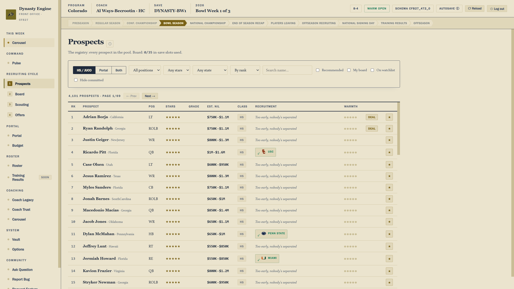

Opening any prospect gives you his card: projected playing time at your
program, an estimated NIL range (a range, never a quote), per-stat grade bands
graded against others at his position, and where his recruitment actually
stands.

## Board

Where you sort the pool into Priority, Target, and Interest tiers, which is
what actually spends your staff's attention.

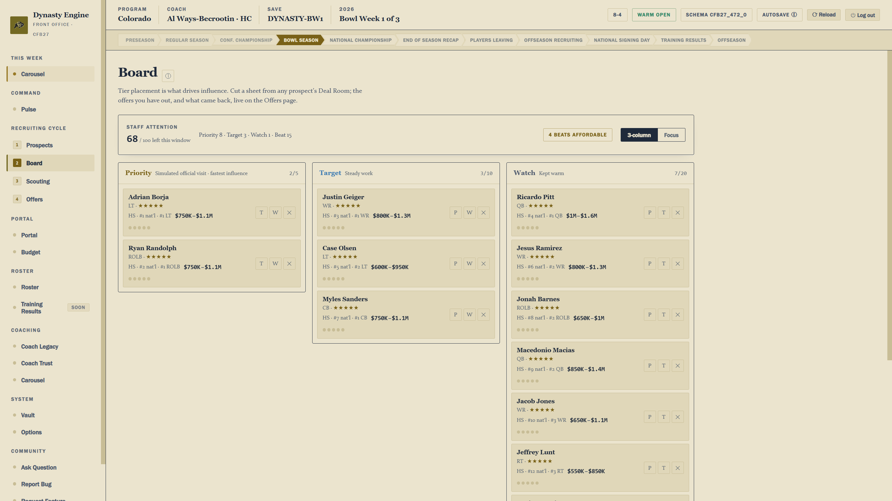

## Scouting

The beat network. Assign staff beats to a position group in a region and let
them file reports over time.

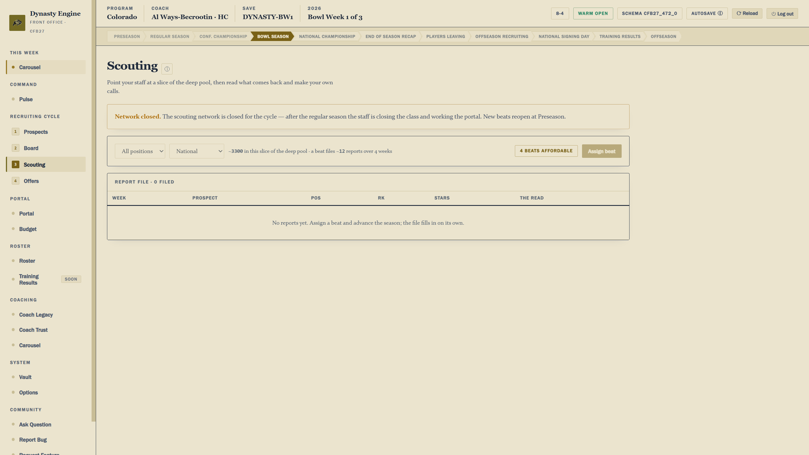

## Offers

What the sheets you cut actually bought.

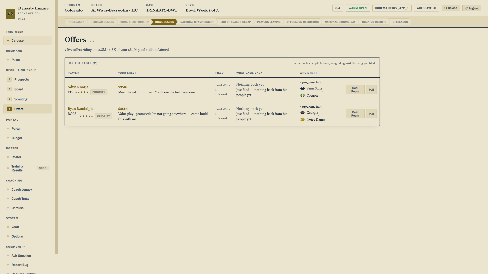

## Transfer Portal

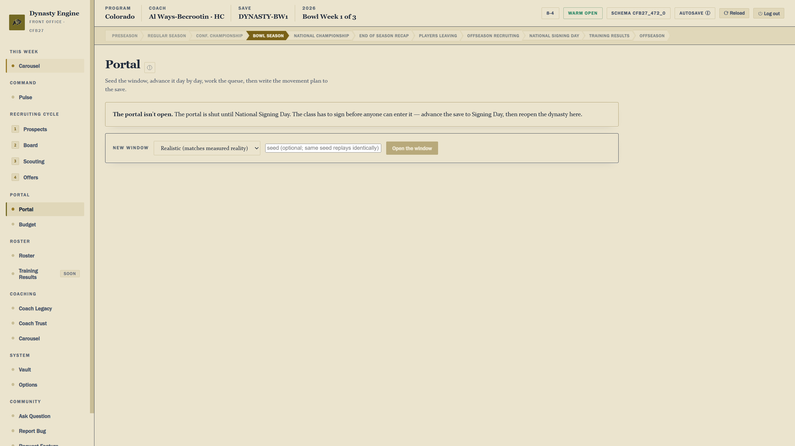

## Budget

The NIL ledger: one annual pool covering the roster book, recruit deals, and
retention raises, with your true headroom and what's at risk in open offers.
The forward view projects what next year's book looks like once graduating
seniors and likely early NFL declarations come off it.

## Roster

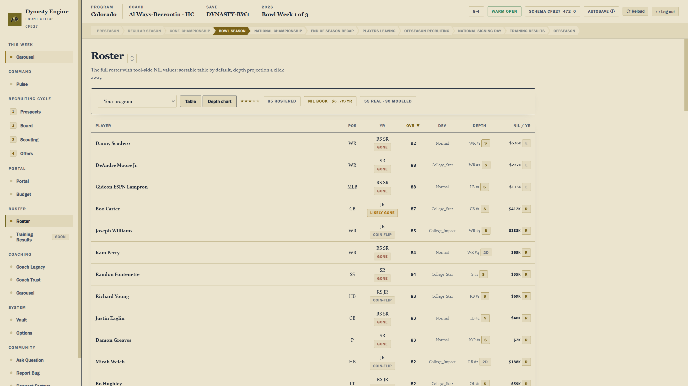

Rostered players are people you'd genuinely know the truth about, so their
cards show real ratings and real NIL, unlike a recruit's bands.

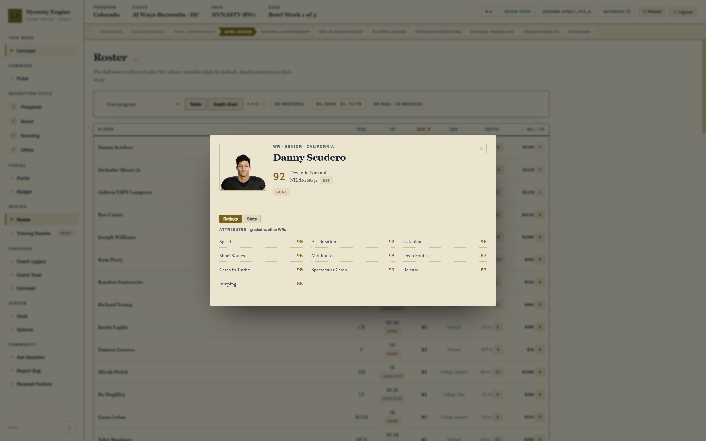

## Training Results

Where you run the annual player-development pass and read what it did: who
broke out, who stalled, what each position group looks like now, and a check
that the league still looks like a real football roster. Every season is
archived and browsable by year.

*(This screenshot predates the real progression engine and shows the old
placeholder version of the screen. The system behind it is
[built and shipping in 0.098](features.md#player-development-how-a-roster-actually-grows);
the screen no longer looks like this.)*

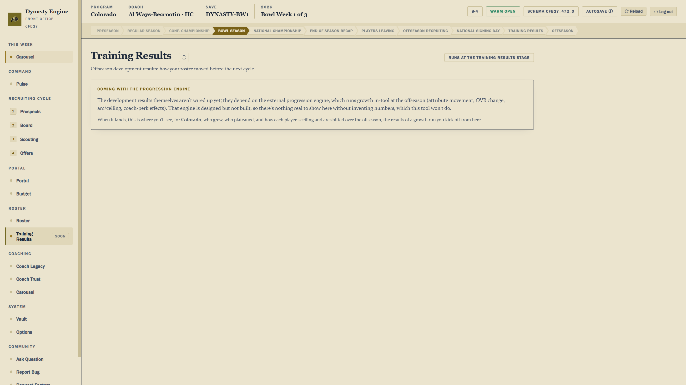

## Coach Legacy

Your career scored on one lifetime number and plotted directly against real
historical coaching legends and every coach in your save.

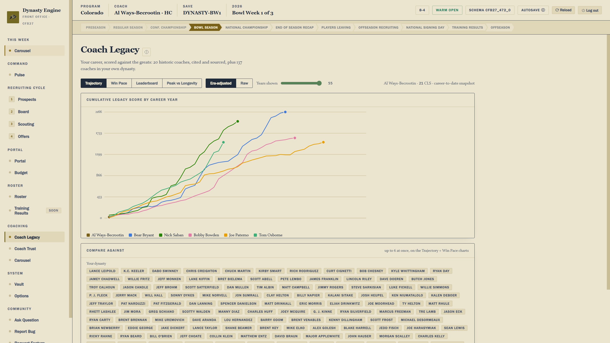

## Coach Trust

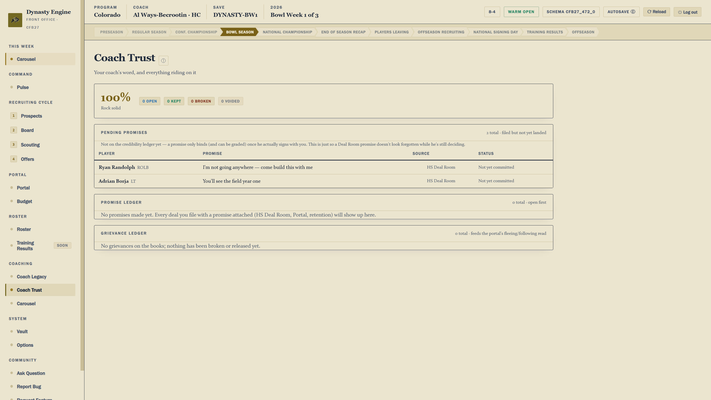

## Coaching Carousel

The league-wide job market. **Edit board** is where you set openings,
candidate ranks, and interest:

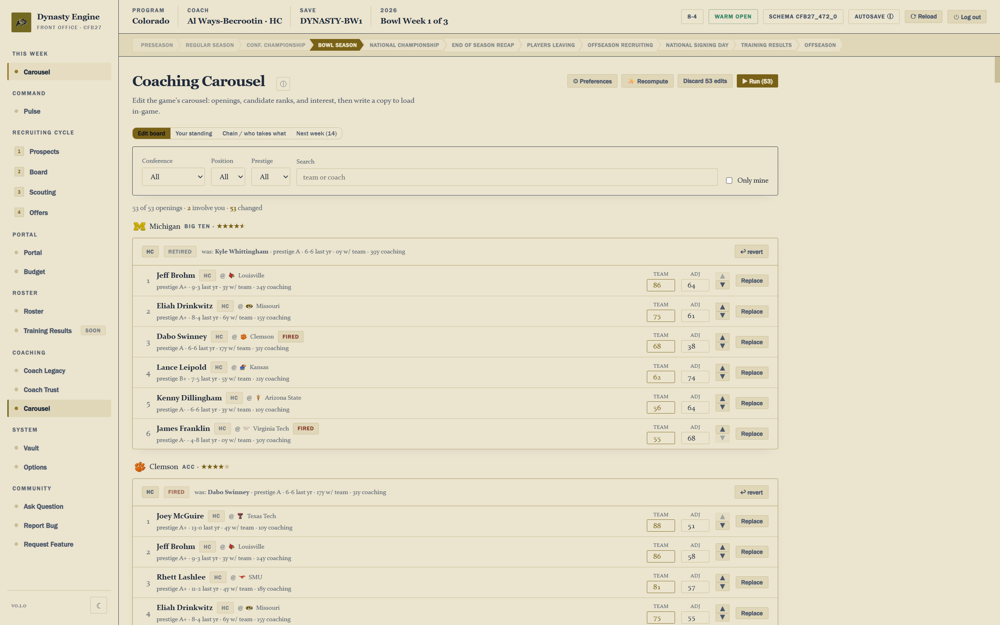

**Your standing** is where your own coach sits in the market:

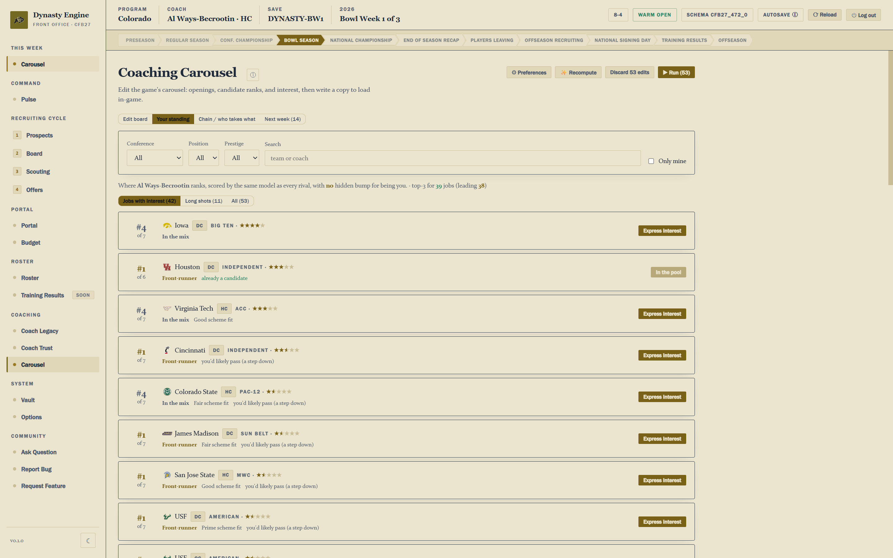

**Chain / who takes what** projects the whole cascade: each team's leading
candidate takes the job he most prefers, which frees the others and lets the
next candidate step up.

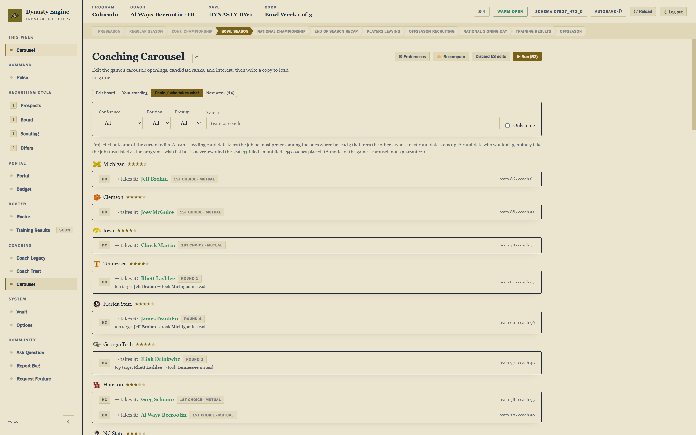

**Next week** simulates the following week's hiring round:

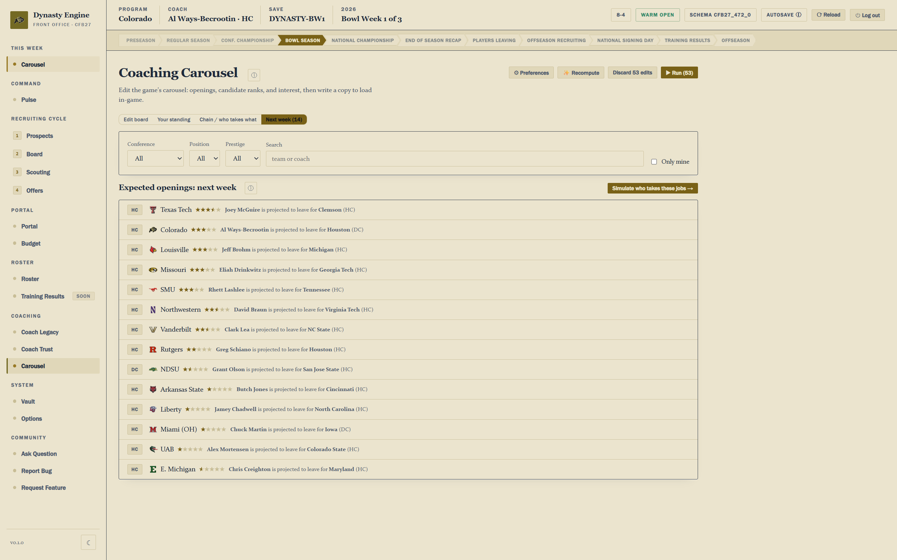

## Vault

Paired checkpoints. Roll the entire world (save + the tool's own memory) back
to a saved moment, always as a matched pair.

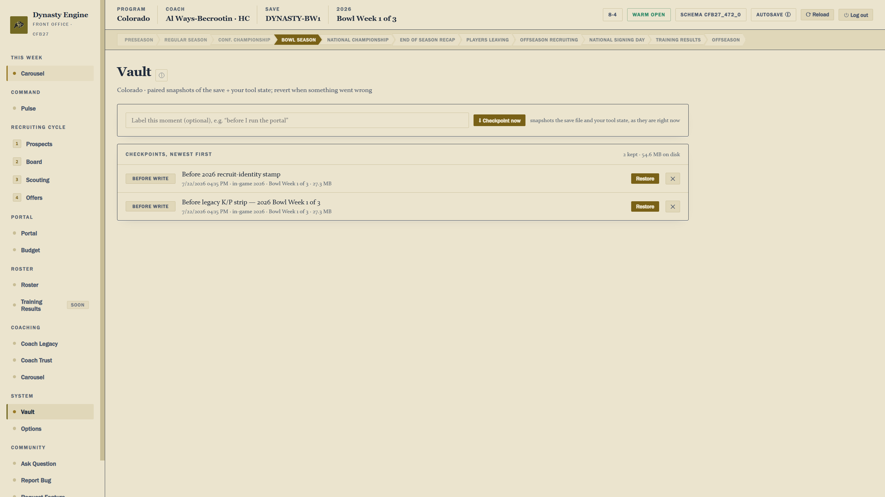

## Options

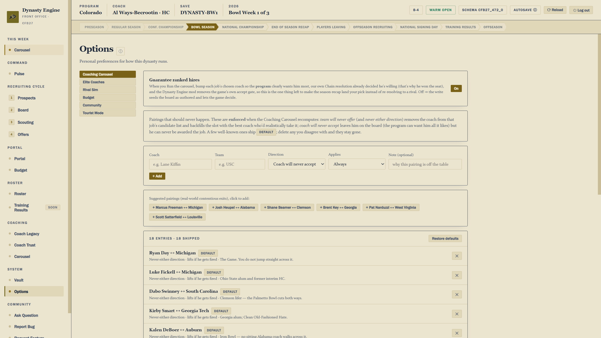

## Screens with no screenshot here yet

These exist in the app and are reachable from the sidebar. They came after this
screenshot set was taken, so there is nothing to show here yet. The walkthrough
video covers them.

- **Getting Started**, the one-time setup gate and the acknowledgements. It stays
  reachable afterward so the "how a week works" instructions can be re-read.
- **Departures Desk**, the end-of-season screen for everyone leaving: graduating
  seniors, early NFL declarations, and portal entrants. It computes a full
  preview, and its write is deliberately disabled pending a feasibility test.
- **Staff Grades**, the six-axis league-wide report card for every staff in your
  save. See
  [Features](features.md#coaching).
- **Promise ledger**, every promise you and the CPU have made, and how each one
  was graded.
- **Discipline**, an empty placeholder for a Phase 3 system. The nav slot exists
  ahead of the design work; there is no engine behind it.
